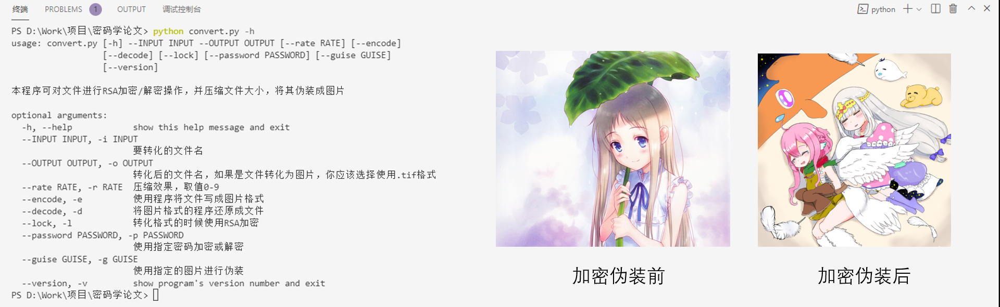
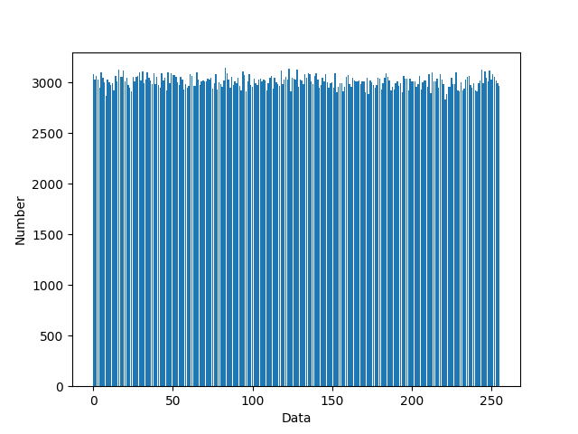

# DISGUISE

你是否有这样的烦恼？
- 有一些文件发给其他人的时候不方便用其本来的面貌发送？
- 一些文件需要套上一层漂亮的皮储存在硬盘里？
- 一些文件加密之后杂乱无章，希望以漂亮的图片的形式分享出去？

本程序可对文件进行RSA加密/解密操作，并压缩文件大小，将其伪装成图片。



## 特点

- [x] 对文件进行RSA加密
- [x] 自动生成RSA密钥
- [x] 对文件进行压缩
- [x] 对文件进行伪装

## 目前支持的输出格式

|格式|8位图片|16位图片|
|-|-|-|
|.tif|√|√|
|.bmp|√||
|.png|√||

## 安全性分析
我们检查加密后的数据是否符合均匀分布，检查的函数是 `security/analyze.py`，效果非常喜人，一个例子的效果如下：

## 用法
```python
usage: convert.py [-h] --INPUT INPUT --OUTPUT OUTPUT [--rate RATE] [--encode]
                  [--decode] [--lock] [--password PASSWORD] [--guise GUISE]
                  [--version] [--bit16]

本程序可对文件进行RSA加密/解密操作，并压缩文件大小，将其伪装成图片

optional arguments:
  -h, --help            show this help message and exit
  --INPUT INPUT, -i INPUT
                        要转化的文件名
  --OUTPUT OUTPUT, -o OUTPUT
                        转化后的文件名，如果是文件转化为图片，你应该选择使用.tif或.png格式
  --rate RATE, -r RATE  压缩效果，取值0-9
  --encode, -e          使用程序将文件写成图片格式
  --decode, -d          将图片格式的程序还原成文件
  --lock, -l            转化格式的时候使用RSA加密
  --password PASSWORD, -p PASSWORD
                        使用指定密码加密或解密
  --guise GUISE, -g GUISE
                        使用指定的图片进行伪装
  --version, -v         show program's version number and exit
  --bit16, -b           使用16位三通道图像伪装信息，使用该方法的时候应该选择.tif格式输出
```


一些例子可以帮助你来理解：

### 对小说进行压缩伪装

```
python convert.py -e -i 小说.txt -o 小说.tif
```
这里 `-e` 指的是加密，`-i` 和 `-o` 分别指定输入文件和输出文件。可以发现输出的图片应该是杂乱无章的，理想情况下图片的大小可能比文本文件还要小，这是正常的。要对加密后的图片还原成小说，只需要：

```
python convert.py -d -i 小说.tif -o 小说.txt
```
这里 `-d` 指的是解密。

请注意：如果你希望把加密后的图片分享给他人，你应该使用原图。

### 改变小说的压缩效果

要想提高加密时速度，我们可以改变压缩效果，这可能导致加密后的图片变大，压缩效果的参数是 `-r`，数值取值是0-9之间。数值越大则压缩效果越好，加密速度也就越慢。下面是一例综合速度与效果的加密：

```
python convert.py -e -i 小说.txt -o 小说.tif -r 6
```

解密时无需额外输入其他信息，按照上例解密即可。

### 使用图片进行伪装

是的！即使你把奇怪的东西加密成一张图片，如果这个图片看上去是杂乱无章的，那么你分享出去不被怀疑才怪！！因此，我们提供了伪装的选项。你可以选定一张图片，我们会使得输出后的效果贴合这张图片的颜色，倒不如说效果极佳！要使用该功能，只需要加入 `-g` 参数，指定加密的图片。图片应当尽可能接近于方形。

```
python convert.py -e -i 小说.txt -o 小说.png -g 1.jpg
```

加密后的图片将相比直接加密要大，但是这是必要的不是吗？我们来看看效果：

|origin|guise|output|decode|
|-|-|-|-|
|||||

这样你就可以大胆地把 `output.png` 发给朋友了！绝对不会有人发现这张公主照片下面居然藏着这么一个治愈的故事的！

### 增加图片伪装的质量
上节中的例子容易看出，伪装后图片 `output.png` 的质量相比于 `guise.png` 的质量要低，这是正常的，要想使用高质量的伪装方法，你可以使用16位三通道的 `tiff` 格式为伪装

```
python convert.py -e -i 小说.txt -o 小说.tif -g 1.jpg -b
```

其中 `-b` 即 `--bit16`。此方法只支持 `tiff` 格式。

### 使用RSA算法进行加密

是的，即使使用了图片伪装也有被破译的可能，有没有办法可以让我把图片公开地放在社交媒体上，但是只有获得密码的人才能知道真正的内容呢？我们提供了RSA加密的方法，即使有人使用了本程序解密，也看不出真正的问题哒！要使用该方法，只需要加密时加入 `-l` 和 `-p` 参数即可，例如：

```
python convert.py -e -i 小说.txt -o 小说.tif -l -p rsa.pub
```

其中，`-l` 参数的加密开关，`-p` 参数是指定加密用的RSA公钥，安全起见，本程序将统一使用 2048 位公钥加密，因此指定 1024 位公钥可能会报错。如果缺省 `-p` 参数，则会在当前文件夹生成一组密钥，公钥是 `rsa.pub`，私钥是 `rsa`。要想解密加密后的信息，只需要在解密是指定私钥即可：

```
python convert.py -d -i 小说.tif -o 小说.txt -p rsa
```

解密过程可能有点慢，因此，请不要使用RSA加密太大的内容噢~

### 一个实例

要想符合本文档中展示的效果，我们使用 `test/` 中的文件进行展示：

```
python convert.py -e -i test/origin.jpg -o test/output.png -g test/guise.png -l
```

这里叠了好多好多的buff，因此我可以保证 `output.tif` 安全得很。要想解密上述文件，只需要：

```
python convert.py -d -i test/output.tif -o decode.jpg -p rsa
```

这样就能得到上述效果了。

### 练习
尝试对 `readme.png` 解密：

```
python convert.py -d -i readme.png -o readme.md
```

## LICENCE
GPL 3.0. 具体请查看 `LICENCE` 文件。

## 支持
欢迎提出 ISSUE.
